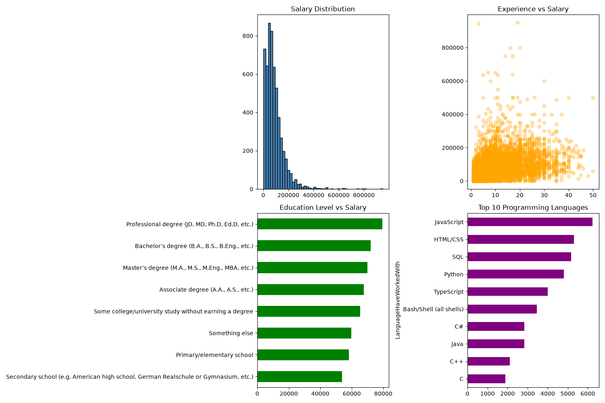
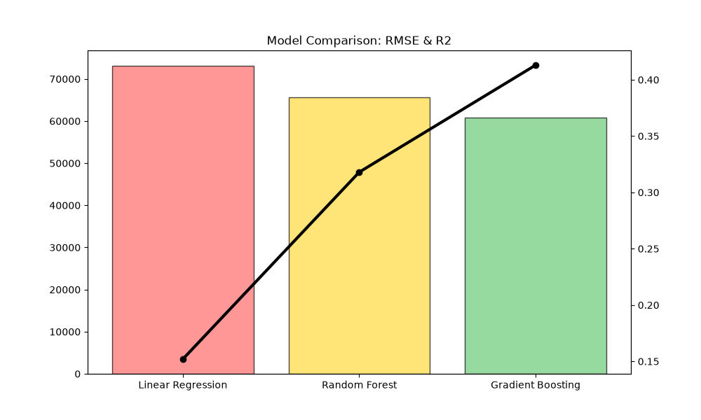
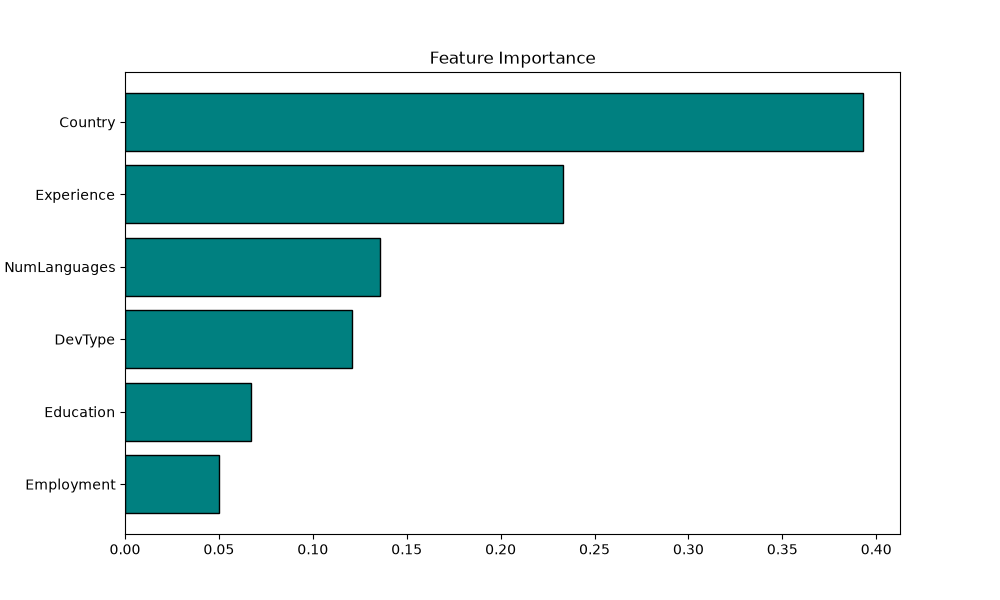

# 🚀 Predicting Software Developer Salaries — A Regression Approach

This project investigates the factors influencing software developer compensation globally, utilizing advanced regression techniques to provide data-driven insights.

---

## 📂 01. Dataset Overview
The project is powered by the official Stack Overflow 2024 Dataset. Due to its size, the raw data is excluded from the repository.

🔗 **Link to Dataset:** [Stack Overflow Annual Developer Survey 2024 (Kaggle)](https://www.kaggle.com/datasets/berkayalan/stack-overflow-annual-developer-survey-2024)

- **Total Responses:** 65,000+
- **Cleaned Sample Size:** 5,608 entries
- **Target Variable:** `ConvertedCompYearly` (Annual Salary in USD)

---

## 🛠️ 02. Technical Methodology
A robust pipeline was implemented to ensure model accuracy and data integrity:

| Step | Action |
| :--- | :--- |
| **Data Cleaning** | Dropped missing compensation values and handled non-numeric experience entries. |
| **Outlier Removal** | Excluded extreme salary outliers (> $1,000,000) to stabilize training. |
| **Feature Engineering** | Engineered `NumLanguages` to quantify technical depth. |
| **Encoding** | Applied `LabelEncoder` for categorical variables like Country, Education, and Role. |

---

## 📊 03. Exploratory Data Analysis (EDA)
We analyzed geographic trends, experience-salary correlations, and education impacts.

  

---

## 🤖 04. Machine Learning Models & Results
Three powerful regression algorithms were evaluated based on **RMSE** (Error) and **R²** (Predictive Power).

### Performance Metrics Table
| Model | RMSE (Error) 📉 | R² (Accuracy) 📈 |
| :--- | :--- | :--- |
| Linear Regression | $73,123 | 0.152 |
| Random Forest | $65,582 | 0.318 |
| **Gradient Boosting** | **$60,818** | **0.413** |

  

---

## 🎯 05. Key Insights (Feature Importance)
What determines a developer's salary? Our Random Forest analysis highlights:

1. **Country (39.3%)**: Geography is the #1 factor.
2. **Experience (23.3%)**: Seniority leads to exponential growth.
3. **Tech Stack (13.6%)**: Knowing more languages correlates with higher pay.

  

---

## 🎓 06. Conclusion
- **Gradient Boosting** is the superior model for this tabular data.
- Practical experience and geographic location far outweigh formal education credentials in the current market.
- Future work involves hyperparameter tuning (GridSearchCV) and building a live Flask/Streamlit web app.

---
**COM2502 Introduction to Data Science**  
**Group 31** | **May 2026**
